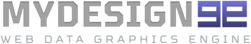

# MyDesign99 Server Demo for Python/Django

Use the MyDesign99 Server Demo for python to test the MyDesign99 Image Authentication SDK



> ** **
> **To be used on your Python or Django server**
> ** **

# Installation

Depending on how you install this repository, you may need to also install the SDK manually

```
pip install "md99authtoken"
  or
py -m pip install "md99authtoken"
```

## Simple Source Code

The MyDesign99 demo involves only 3 source code modules. The purpose is simply to see an example of the SDK in use.

```
index.py    - contains the logic necessary to parse the incoming URL's
            - interprets the URL's and passes the information to the MD99 SDK
            - the SDK retrieves a valid image authentication token from MD99
            - takes the returned auth token and forms a valid image URL			
config.py   - contains settings used to connect to the MD99 servers
data.py     - contains the customer names and their scores
```

## Configuration

The following 3 values need to entered in the config.py file

```
public_key      - use either:
                  1) the Public key from your existing MyDesign99 dashboard
                  2) request the public/secret keys for Demos from the 
                     MyDesign99 website
secret_key      - use either:
                  1) the Secret key from your existing MyDesign99 dashboard
                  2) request the public/secret keys for Demos from the 
                     MyDesign99 website
default_asset   - currently, this should be "radial-basic"
```

## USAGE

At the bottom of index.py, uncomment one of these lines

```
entryPoint1()
  or
entryPoint2()
  or
entryPoint3()
```

Make sure that the other two entry points are commented out. To use the first example:
```
entryPoint1()
#entryPoint2()
#entryPoint3()
```

entryPoint1 is used for Sample GET #1
entryPoint2 is used for Sample GET #2
entryPoint3 is used for Sample POST

## Sample GET URL #1

```
https://yourdomain.com/getauthurl/{data_value}/{asset_name}
```

An actual URL could be:

```
https://acme.com/getauthurl/85/radial-demo
```
This returns a well formed image URL for a design you have created called "radial-demo", showing the number "85" in that design.

### Valid asset names for the demo:

radial-demo


## Sample GET URL #2 (get customer score image)

```
https://yourdomain.com/get/customer/score/{customer_name}
```

An actual URL could be:

```
https://yourdomain.com/get/customer/score/betty
```
This looks up the customer named "betty" and returns a well-formed image URL for her score and the asset name stored in the configuration file

### Valid customer names:

betty, billy, john, frank, karen


## Sample POST URL

```
https://yourdomain.com/get/authurl/from/post
```

POST parameters
```
value       - a number between 1 and 100
asset_name  - a valid asset created at MyDesign99 for the demo account (use 'radial-demo')
```

One way to use this demo is with Curl on a command line
```
curl -H "Content-Type:application/json" -d "{\"asset_name\":\"bar-full\",\"value\":\"69\"}" -X POST http://yourdomain.com/get/authurl/from/post
```
Remember to replace "yourdomain.com" with your own domain name

### Valid asset names for the demo:

radial-demo

